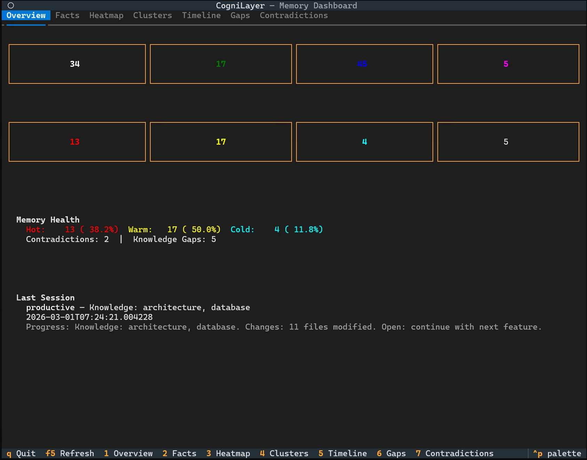
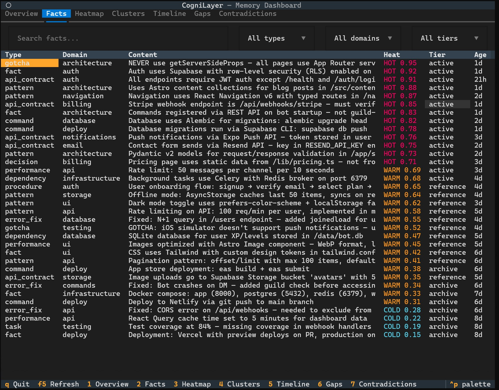
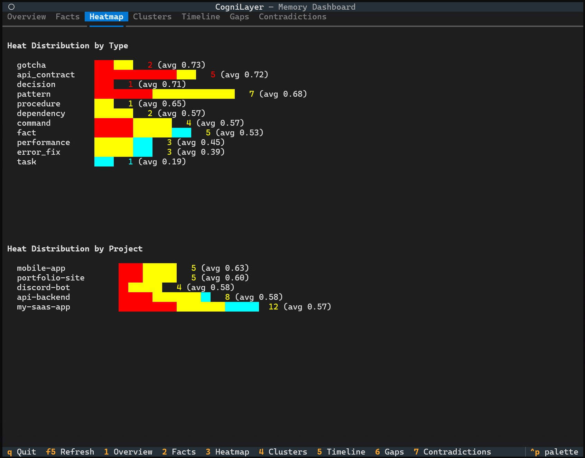
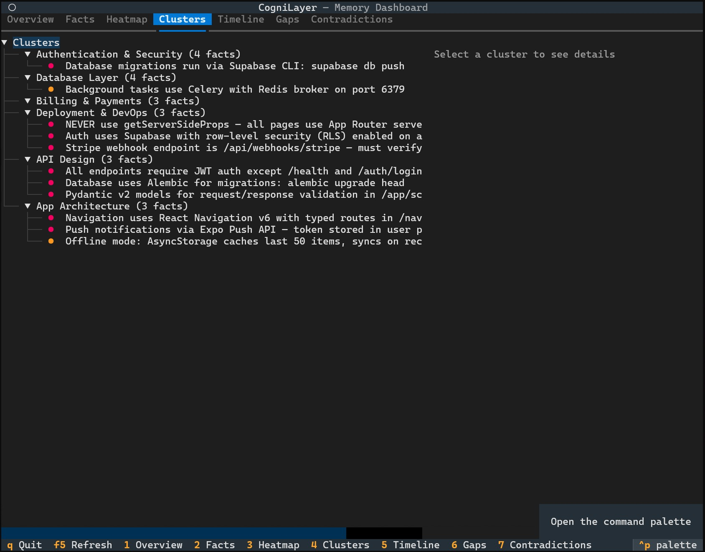
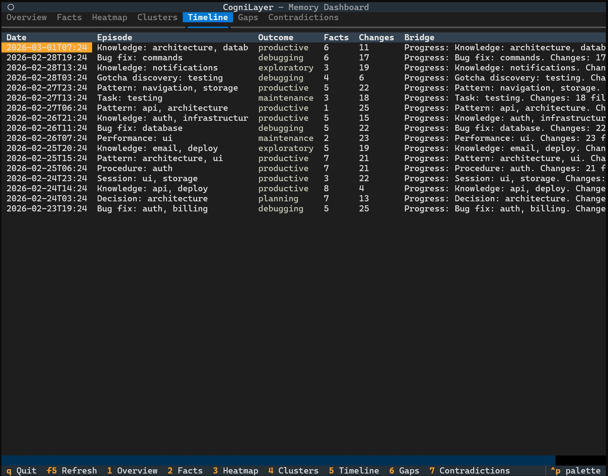

# CogniLayer v3

### One brain. Two agents. All your projects.

Use Claude Code in the morning, switch to Codex CLI in the afternoon — **they share the same memory.** Debug a tricky auth issue with Claude, open Codex later — it already knows what happened. No re-explaining, no re-reading files. That's not just persistent memory, that's **agent interoperability**.

> **Shared memory between Claude Code & Codex CLI** | **Save ~80-100K tokens/session** | **Crash recovery** | **Cross-project intelligence**

CogniLayer gives your AI coding agents a **shared brain** — a local SQLite database with 13 MCP tools, hybrid search, and automatic session tracking. Every fact, decision, gotcha, and debugging session survives across sessions, agents, projects, and crashes.

[](#)
[](LICENSE)
[](https://www.python.org/)
[](https://modelcontextprotocol.io/)
[](#)
[](#)

---

## Why You Need This

### Switch agents without losing context
Claude Code and Codex CLI share the same memory database. Start a task with one, finish with the other. **No other tool does this.**

### Save 80-100K tokens per session
Without CogniLayer, your agent re-reads the codebase from scratch every session. With it — a few KB of compact context injected via MCP. Pays for itself on day one.

### Crash immunity
Session killed? Terminal closed? Computer died? CogniLayer auto-recovers from the change log. Next session picks up where you left off — in either agent.

### Cross-project intelligence
Solved a CORS issue in project A three weeks ago? Search that knowledge from project B. Your experience compounds across all your projects.

### Deployment safety
Managing multiple servers? The Identity Card system blocks you from deploying to the wrong one. `verify_identity("deploy")` before every push to prod.

---

## What It Does

| Feature | What it means for you |
|---------|----------------------|
| **Shared Agent Memory** | Claude Code and Codex CLI read from the same brain — switch agents without losing context |
| **Crash Recovery** | Session dies? Next one auto-recovers from the change log — in either agent |
| **Cross-Project Search** | Working on app B? Search what you learned in app A |
| **14 Structured Fact Types** | Not dumb notes — error fixes, API contracts, gotchas, procedures, decisions... |
| **Session Bridges** | Each session starts with a summary of what happened last time |
| **Staleness Detection** | Changed a file? CogniLayer warns when a remembered fact might be outdated |
| **Hybrid Search** | Fulltext + AI vector search finds the right fact every time |
| **Heat Decay** | Hot facts surface first, cold facts fade — like real memory |
| **Deployment Safety** | Identity Card system blocks you from deploying to the wrong server |
| **Knowledge Linking** | Zettelkasten-style connections between facts, cause/effect chains |
| **Contradiction Detection** | Finds conflicting facts before they cause bugs |
| **TUI Dashboard** | Visual memory browser with 7 tabs — see everything at a glance |
| **Doc Indexing** | Your PRDs, READMEs, and configs chunked into searchable pieces |

---

## How It Works (The Simple Version)

```
You start a Claude Code session
    ↓
CogniLayer injects what it knows about your project
(architecture, last session's progress, key decisions)
    ↓
You work normally — Claude saves important things to memory automatically
    ↓
Session ends (or crashes)
    ↓
Next session starts with full context — no re-reading, no re-explaining
```

**Zero effort after install.** No commands to learn, no workflow changes. CogniLayer runs in the background via hooks and an MCP server. Claude knows how to use it automatically.

---

## Quick Start

### 1. Install (30 seconds)

```bash
git clone https://github.com/LakyFx/CogniLayer.git
cd CogniLayer
python install.py
```

That's it. Next time you start Claude Code, CogniLayer is active.

### 2. Optional: Turbocharge search

```bash
# AI-powered vector search (recommended — finds facts even with different wording)
pip install fastembed sqlite-vec
```

### 3. Optional: Add Codex CLI support

```bash
python install.py --codex    # Codex CLI only
python install.py --both     # Claude Code + Codex CLI
```

### 4. Verify

```bash
python ~/.cognilayer/mcp-server/server.py --test
# → "OK: All 13 tools registered."
```

### Troubleshooting

MCP server not connecting? Run the diagnostic tool:
```bash
python diagnose.py          # Check everything
python diagnose.py --fix    # Check + auto-fix missing dependencies
```

### Requirements
- Python 3.11+
- Claude Code and/or Codex CLI
- pip packages: `mcp`, `pyyaml`, `textual` (installed automatically), `fastembed`, `sqlite-vec` (optional)

---

## Slash Commands

Once installed, use these in Claude Code:

| Command | What it does |
|---------|-------------|
| `/status` | Show memory stats and project health |
| `/recall [query]` | Search memory for specific knowledge |
| `/harvest` | Extract and save knowledge from current session |
| `/onboard` | Scan your project and build initial memory |
| `/onboard-all` | Batch onboard all projects in your workspace |
| `/forget [query]` | Delete specific facts from memory |
| `/identity` | Manage deployment Identity Card |
| `/consolidate` | Organize memory — cluster, detect contradictions, assign tiers |
| `/tui` | Launch the visual dashboard |

---

## TUI Dashboard

A visual memory browser right in your terminal. 7 tabs, keyboard navigation, works on Windows, Mac, and Linux.

```bash
cognilayer                    # All projects
cognilayer --project my-app   # Specific project
cognilayer --demo             # Demo mode with sample data (try it!)
```

### Overview — stats at a glance


### Facts — searchable, filterable, color-coded by heat


### Heatmap — see which knowledge is hot, warm, or cold


### Clusters — related facts organized into groups


### Timeline — full session history with outcomes


*Screenshots show demo mode (`cognilayer --demo`) with sample data.*

---

## Upgrading

The upgrade is safe and non-destructive. Your memory is never lost:

```bash
git pull
python install.py
```

What happens under the hood:
- Code files are replaced with the latest versions
- `config.yaml` is **never overwritten** (your settings are safe)
- `memory.db` is **backed up automatically** before any migration
- Schema migration is **purely additive** (new columns/tables, never deletions)
- CLAUDE.md blocks update automatically on next session start

### Rollback

If something goes wrong:
```bash
# Your backup is timestamped
cp ~/.cognilayer/memory.db.backup-YYYYMMDD-HHMMSS ~/.cognilayer/memory.db
# Restore old code
git checkout <previous-commit> && python install.py
```

---

## Configuration

Edit `~/.cognilayer/config.yaml`:

```yaml
# Language — "en" (default) or "cs" (Czech)
language: "en"

# Your projects directory
projects:
  base_path: "~/projects"

# Indexer settings
indexer:
  scan_depth: 3
  chunk_max_chars: 2000

# Search defaults
search:
  default_limit: 5
  max_limit: 10
```

---

## Known Limitations

- **Concurrent CLIs**: Running Claude Code and Codex CLI simultaneously on the same project may cause session tracking conflicts. Use one CLI at a time per project.
- **Codex file tracking**: Codex CLI has no hooks, so automatic file change tracking is not available for Codex sessions.
- **TUI**: Requires `textual` package. Read-only except for resolving contradictions.

---

# Architecture (for the curious)

*Everything below is for developers who want to understand how CogniLayer works under the hood.*

## System Overview

```
Claude Code / Codex CLI Session
    │
    ├── SessionStart hook (Claude Code) / session_init tool (Codex)
    │   └── Injects Project DNA + last session bridge into CLAUDE.md
    │
    ├── MCP Server (13 tools)
    │   ├── memory_search    — Hybrid FTS5 + vector search with staleness detection
    │   ├── memory_write     — Store facts (14 types, deduplication, auto-embedding)
    │   ├── memory_delete    — Remove outdated facts by ID
    │   ├── memory_link      — Bidirectional Zettelkasten-style fact linking
    │   ├── memory_chain     — Causal chains (caused, led_to, blocked, fixed, broke)
    │   ├── file_search      — Search indexed project docs (chunked, not full files)
    │   ├── project_context  — Get project DNA + health metrics
    │   ├── session_bridge   — Save/load session continuity summaries
    │   ├── session_init     — Initialize session for Codex CLI (replaces hooks)
    │   ├── decision_log     — Query append-only decision history
    │   ├── verify_identity  — Safety gate before deploy/SSH/push
    │   ├── identity_set     — Configure project Identity Card
    │   └── recommend_tech   — Suggest tech stacks from similar projects
    │
    ├── PostToolUse hook (Claude Code only)
    │   └── Logs every file Write/Edit to changes table (<1ms overhead)
    │
    └── SessionEnd hook / session_bridge(save)
        └── Closes session, builds emergency bridge if needed
```

## File Structure

```
~/.cognilayer/
├── memory.db              # SQLite (WAL mode, FTS5, 17 tables)
├── config.yaml            # Configuration (never overwritten by installer)
├── active_session.json    # Current session state (runtime)
├── mcp-server/
│   ├── server.py          # MCP entry point (13 tools)
│   ├── db.py              # Shared DB helper (WAL, busy_timeout, lazy vec loading)
│   ├── i18n.py            # Translations (EN + CS)
│   ├── init_db.py         # Schema creation + migration
│   ├── embedder.py        # fastembed wrapper (BAAI/bge-small-en-v1.5, 384-dim)
│   ├── register_codex.py  # Codex CLI config.toml registration
│   ├── indexer/           # File scanning and chunking
│   ├── search/            # FTS5 + vector hybrid search
│   └── tools/             # 13 MCP tool implementations
├── hooks/
│   ├── on_session_start.py    # Project detection, DNA injection, crash recovery
│   ├── on_session_end.py      # Session close, emergency bridge, episode building
│   ├── on_file_change.py      # PostToolUse file change logger
│   ├── generate_agents_md.py  # Codex AGENTS.md generator
│   └── register.py            # Claude Code settings.json registration
├── tui/                       # TUI Dashboard (Textual)
│   ├── app.py                 # Main application (7 tabs, keyboard nav)
│   ├── data.py                # Read-only SQLite data access layer
│   ├── styles.tcss            # CSS stylesheet
│   ├── screens/               # 7 tab screen modules
│   └── widgets/               # Heat cell, stats card widgets
└── logs/
    └── cognilayer.log
```

## Database Schema (17 tables)

| Table | Purpose |
|-------|---------|
| `projects` | Registered projects with auto-generated DNA |
| `facts` | 14 types of atomic knowledge units with heat scores |
| `facts_fts` | FTS5 fulltext index on facts |
| `file_chunks` | Indexed project documentation (PRDs, READMEs, configs) |
| `chunks_fts` | FTS5 fulltext index on chunks |
| `decisions` | Append-only decision log |
| `sessions` | Session records with bridges, episodes, and outcomes |
| `changes` | Automatic file change log (PostToolUse) |
| `project_identity` | Identity Card (SSH, ports, domains, safety locks) |
| `identity_audit_log` | Safety field change audit trail |
| `tech_templates` | Reusable tech stack templates |
| `fact_links` | Zettelkasten bidirectional links between facts |
| `knowledge_gaps` | Tracked weak/failed searches |
| `fact_clusters` | Memory consolidation output clusters |
| `contradictions` | Detected conflicting facts |
| `causal_chains` | Cause → effect relationship tracking |
| `facts_vec` / `chunks_vec` | Vector embeddings (sqlite-vec, optional) |

## Hybrid Search

Two search engines combined for maximum recall:

1. **FTS5** — SQLite fulltext search for exact keyword matching
2. **Vector embeddings** — [fastembed](https://github.com/qdrant/fastembed) (BAAI/bge-small-en-v1.5, 384-dim, CPU-only ONNX) with [sqlite-vec](https://github.com/asg017/sqlite-vec) for cosine similarity
3. **Hybrid ranker** — 40% FTS5 + 60% vector similarity, with heat score boosting

Vector search is optional — FTS5 works standalone without any extra dependencies.

## Heat Decay

Facts have a "temperature" that models relevance over time:

| Range | Label | Meaning |
|-------|-------|---------|
| 0.7 - 1.0 | **Hot** | Recently accessed, high relevance |
| 0.3 - 0.7 | **Warm** | Moderately recent |
| 0.05 - 0.3 | **Cold** | Old, rarely accessed |

Decay rates vary by fact type — `error_fix` and `gotcha` facts decay slower (they stay relevant longer) than `task` facts. Each search hit boosts a fact's heat score.

## Codex CLI Integration

Codex CLI has no hook system, so CogniLayer adapts:

| Aspect | Claude Code | Codex CLI |
|--------|------------|-----------|
| Config | `~/.claude/settings.json` | `~/.codex/config.toml` |
| Hooks | SessionStart/End/PostToolUse | None — uses MCP tools + AGENTS.md instructions |
| Instructions | `CLAUDE.md` | `AGENTS.md` (generated by `generate_agents_md.py`) |
| Session init | Automatic via hook | `session_init` MCP tool called per AGENTS.md instructions |
| File tracking | Automatic via PostToolUse | Not available (acceptable limitation) |

Same memory database shared between both CLIs.

## Project Identity Card

Deployment safety system that prevents "oops, wrong server" incidents:

- **Safety locking** — locked fields require explicit update + audit log entry
- **Hash verification** — SHA-256 detects tampering of safety-critical fields
- **Required field checks** — `verify_identity` blocks deploy if critical fields are missing
- **Audit trail** — every safety field change is logged with timestamp and reason

---

## Contributing

Contributions are welcome! Please open an issue first to discuss what you'd like to change.

## License

[Elastic License 2.0](LICENSE) — Free to use, modify, and distribute. You may not provide it as a managed/hosted service.
